## 2D radar Simulation Library

该库用于2D雷达仿真，本人才疏学浅，如有错误请多多包涵，指正。 

`radar2D_lib`: 库文件夹

`interconnecitonMain.m`: 航迹互联算法仿真的示例

`kalmanMain.m`: 卡尔曼滤波算法的仿真示例

`startTrackMain.m`: 航迹起始算法的仿真示例

## 库文件说明

以下算法库，用户均可以按照库中相应算法的编写规范加入到库中，在该框架下对算法进行仿真

#### filters2D.m

该文件实现了NNSF, PDA, JPDA, KF等常见的互联滤波算法的仿真实现

#### initTrackStruct2D.m

仿真的航迹信息以结构体的方式保存，该文件用于初始化一个航迹结构体

#### radars2D.m

该文件用于生成一个雷达模型

#### startTrack2D.m

航迹起始算法，实现了直观法和逻辑法

#### targets2D.m

该文件用于生成运动目标和杂波，用户可以按照`linearMotion`函数的编写方式，编写自己的运动函数

#### trackFusion2D.m

用于航迹融合，但还未完全实现

#### trackQuality2D.m

基于打分法的航迹质量管理

## 三个Main.m文件的说明

三个main.m文件提供了库的使用说明，用户可以根据这三个文件编写自己的仿真文件

#### startTrackMain.m

航迹起始算法的仿真，以下为仿真结果

| | |
|:---: | :---: |
| 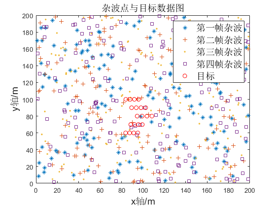 | 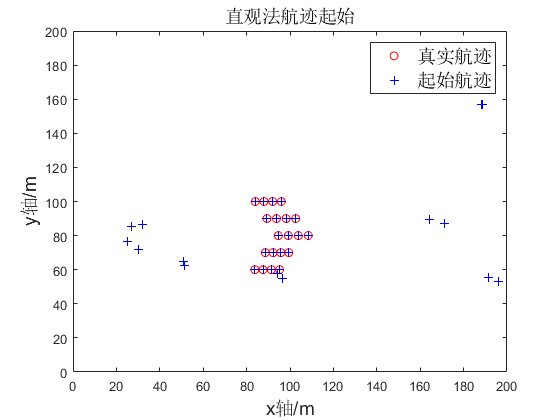 |
| 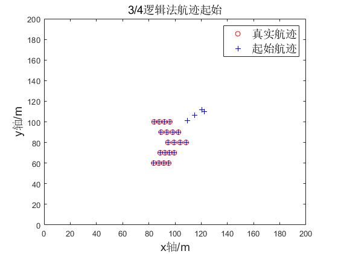 | |

#### kalmanMain.m

以下为kf仿真结果, q=0, 非机动目标

| | |
|:---: | :---: |
| 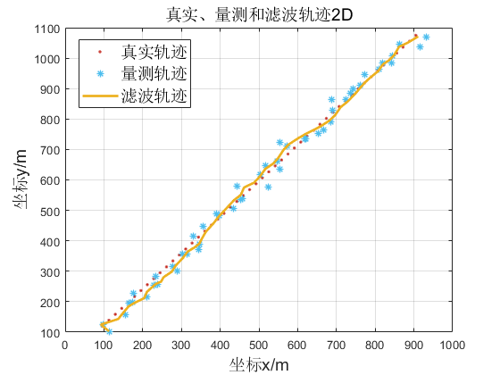 | 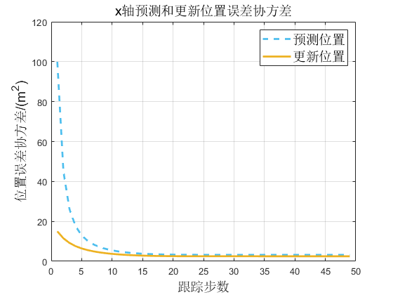 |
| 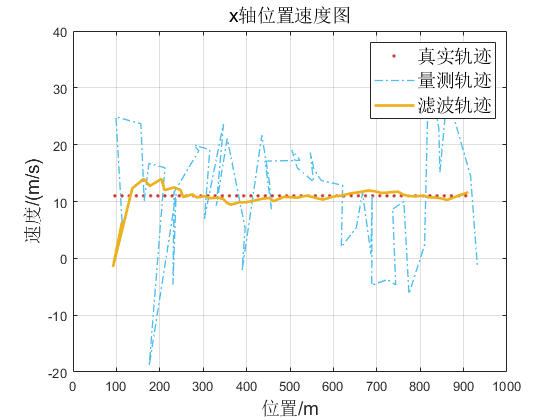 | 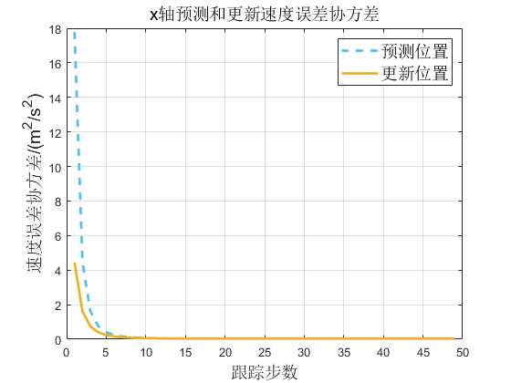 |
| 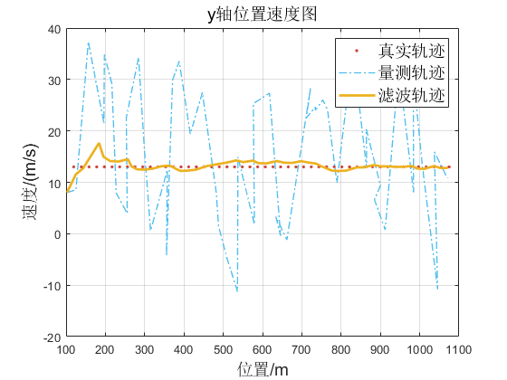 | |

#### interconnectionMain.m
以下为航迹互联算法的仿真结果

| | |
|:---: | :---: |
| 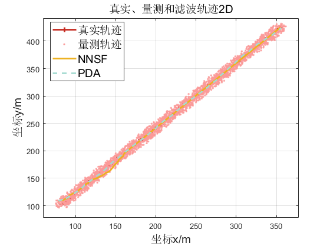 | 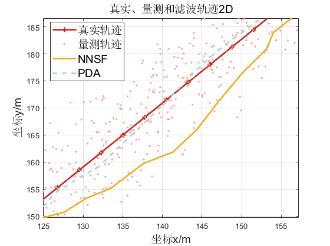 |
| 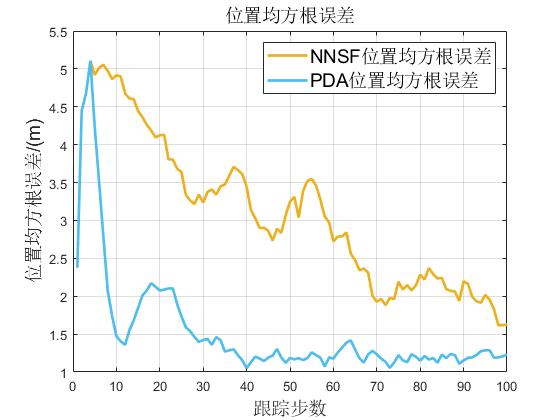 | 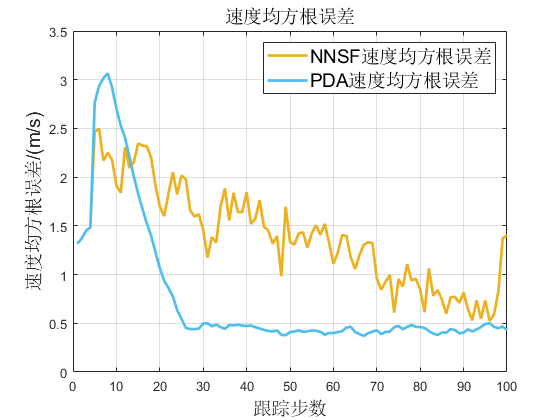 |